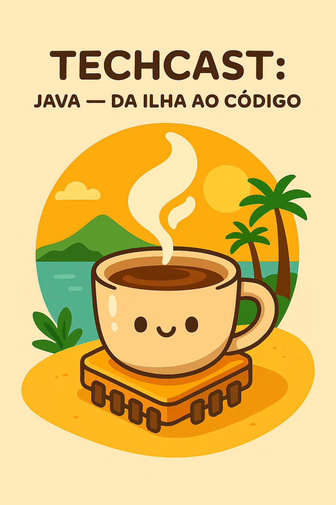

# java-da-ilha-ao-codigo

# 🎙️ TechCast: Java — Da Ilha ao Código ☕🌴

Bem-vindo ao **TechCast**, o podcast onde tecnologia e criatividade se encontram de um jeito simples, divertido e com cheiro de café!  
Este episódio é uma viagem leve e curiosa pelo universo do **Java** — da ilha tropical ao código que move o mundo.

---

## 🧠 Sobre o projeto

Este podcast foi criado como parte de um desafio prático da **DIO (Digital Innovation One)**.  
A ideia foi transformar um conteúdo técnico em algo **acessível, leve e inspirador**, mostrando que aprender tecnologia pode ser divertido.

O episódio **"Java — Da Ilha ao Código"** explica, de forma descontraída, como o Java surgiu, o que ele tem a ver com café e por que até hoje ele é uma das linguagens mais amadas (e temidas 😅) da programação.

---

## 🗂️ Estrutura do repositório

📁 java-da-ilha-ao-codigo
│
├── 🎙️ /audio
│ └── podcastjava.mp3
│
├── 🎨 /imagens
│ └── java.png
│
├── 💬 /prompts
│ ├── prompt-chatgpt.txt
│ ├── prompt-elevenlabs.txt
│ └── prompt-midjourney.txt
│
├── 📜 /roteiro
│ └── roteiro-java.txt
│
└── README.md

---

## 🧩 Ferramentas utilizadas

- **ChatGPT (GPT-5)** → para criação do roteiro e revisão de texto.  
- **ElevenLabs Multilíngue v2 (voz: Alice)** → para gerar a narração em português.  
  - Estabilidade: 50%  
  - Aumento de similitude: 75%  
  - Estilo: 0%  
  - Velocidade: 1  
  - Aumento de alto-falantes: habilitado  
- **Midjourney** → para gerar a capa do podcast.  
- **GitHub** → para versionamento e publicação do projeto.

---

## 🌅 Capa do episódio

---

## 🔊 Ouça o episódio

🎧 [Clique aqui para ouvir o áudio](./podcastjava.mp3)

---

## 📜 Créditos

- **Roteiro e curadoria:** Lizza Méndez  
- **Voz gerada por IA:** Alice (ElevenLabs)  
- **Imagem:** Midjourney  
- **Assistente criativo:** ChatGPT (GPT-5)  
- **Desafio proposto por:** DIO — Digital Innovation One

---

### 💬 “A tecnologia pode ser complexa, mas aprendê-la não precisa ser.”
☕ Java — da ilha ao código.
Um episódio leve, curioso e cheio de café!

---

## 💫 Licença

Este projeto está sob a licença **MIT** — sinta-se à vontade para reutilizar o conteúdo e adaptá-lo

© 2025 Lizza Méndez — Todos os direitos reservados.
